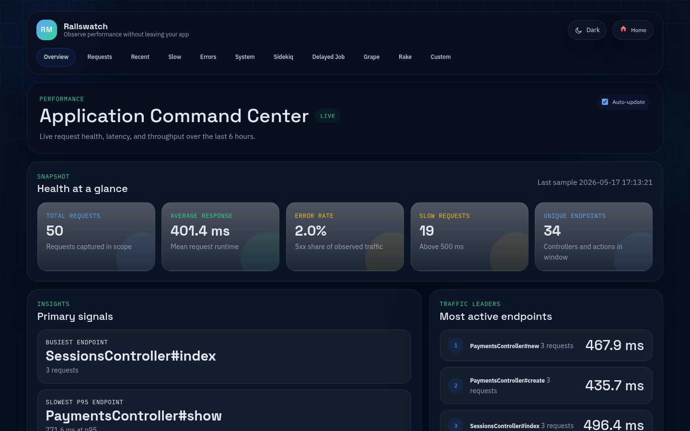
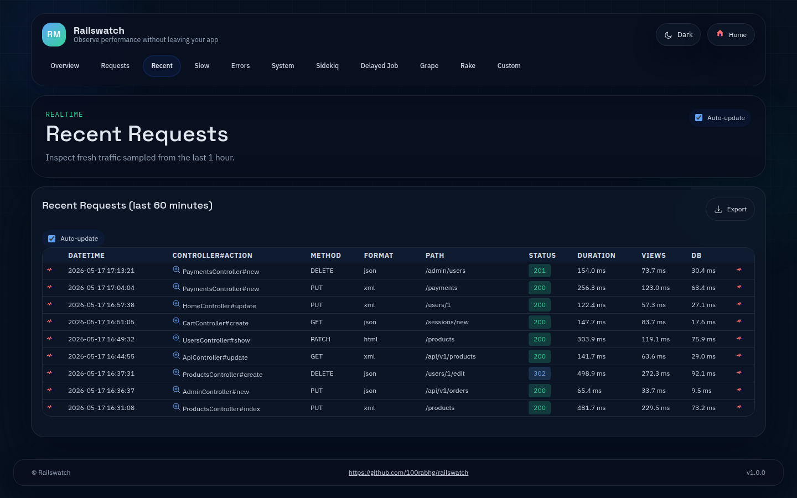
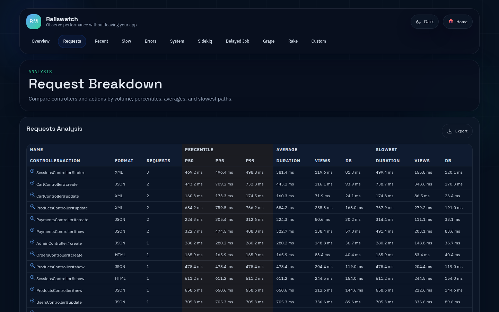
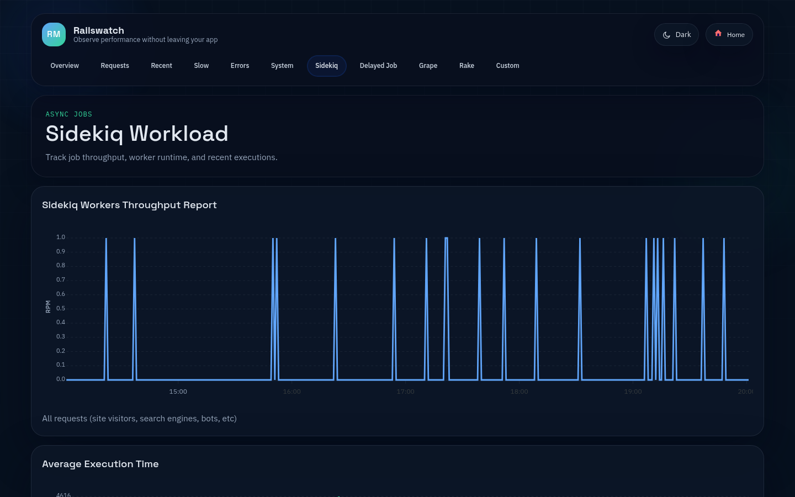
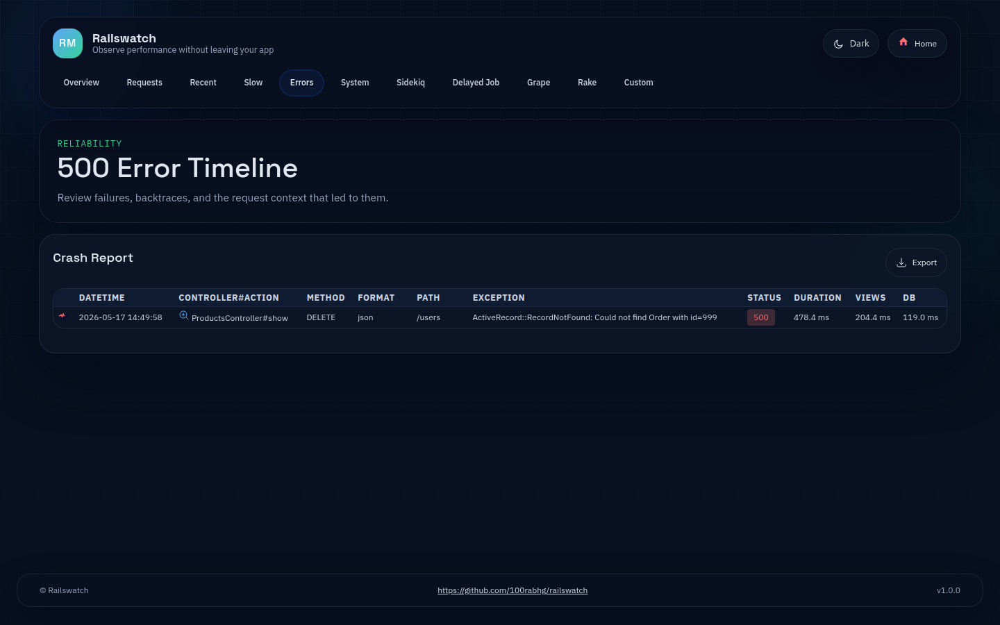
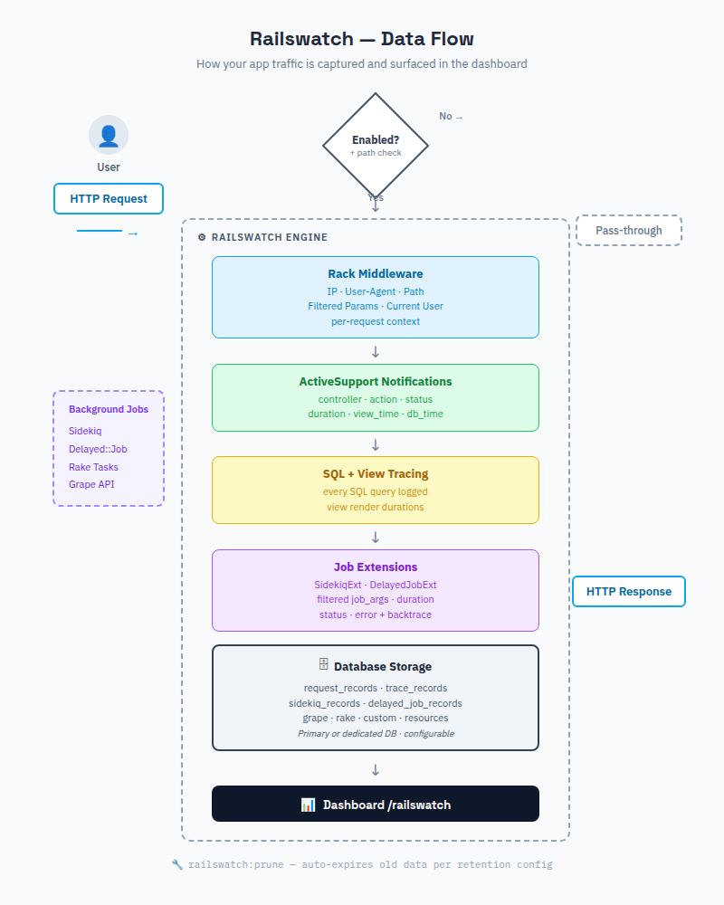

# Railswatch

[](https://github.com/100rabhg/railswatch/actions/workflows/ruby.yml)

A self-hosted tool to monitor the performance of your Ruby on Rails application.

This is a **simple and free alternative** to the New Relic APM, Datadog or other similar services.



P50, P90, P99, throughput, and more is available.

Detailed p50, p90, p99 response time information.



Per-controller breakdown with response time percentiles.



(more screenshots below)

It allows you to track:

- real-time monitoring on the Recent tab
- see your p50, p90, p99 response time
- monitor system resources (CPU, memory, disk)
- monitor slow requests
- throughput report (see amount of RPM (requests per minute))
- an average response time
- the slowest controllers & actions
- total duration of time spent per request, views rendering, DB
- SQL queries, rendering logs in "Recent Requests" section
- simple 500-crashes reports
- deployment events (or custom events)
- Sidekiq jobs
- Delayed Job jobs
- Grape API inside Rails app
- Rake tasks performance
- Custom events wrapped with `Railswatch.measure do .. end` block
- Active Record-backed storage, with optional separate database support on modern Rails multi-database setups

All data are stored in your application's database and not sent to any 3rd party servers.

## Production

Gem is production-ready. At least in my 2 applications with ~1000 unique users per day it works perfectly.

Just don't forget to protect performance dashboard with http basic auth or check of current_user.

## Quick Start

1. Add the gem to your application's `Gemfile`
2. Run `bundle install`
3. Run `bin/rails generate railswatch:install`
4. Run your database migrations for the storage option you chose
5. Start the app, make a few requests, and open `/railswatch`

Railswatch stores monitoring data in your application's database by default.
You do not need Redis for Railswatch storage.

If your application uses Sidekiq, Sidekiq itself still uses Redis, but Railswatch stores the captured job metrics in your database.

## Installation

Add this line to your application's Gemfile:

```ruby
gem 'railswatch'

# or

group :development, :production do
  gem 'railswatch'
end
```

Install dependencies:

```bash
$ bundle install
```

Generate the initializer and migration:

```bash
$ bin/rails generate railswatch:install
```

That generator creates:

- `config/initializers/railswatch.rb`
- `db/migrate/*_create_railswatch_tables.rb`

## Setup Guide

### 1. Choose where monitoring data is stored

#### Option A: Use your primary application database

This is the default and simplest setup:

```ruby
config.database_connection_name = nil
```

Then run:

```bash
$ bin/rails db:migrate
```

#### Option B: Use a separate monitoring database

Add a dedicated database to `config/database.yml`:

```yaml
development:
  primary:
    <<: *default
    database: storage/development.sqlite3
  railswatch:
    <<: *default
    database: storage/development_railswatch.sqlite3

test:
  primary:
    <<: *default
    database: storage/test.sqlite3
  railswatch:
    <<: *default
    database: storage/test_railswatch.sqlite3
```

Then set:

```ruby
config.database_connection_name = :railswatch
```

Run migrations for both databases:

```bash
$ bin/rails db:migrate
$ bin/rails db:migrate:railswatch
```

You can use any connection name you prefer. `config.database_connection_name` must match the database name in `config/database.yml`.

### 2. Start the app

After installation and configuration:

```bash
$ bin/rails server
```

Make a few requests to your app, then open:

```text
http://localhost:3000/railswatch
```

### 3. Protect the dashboard

The dashboard should not be publicly accessible in production.

You can protect it with HTTP Basic auth:

```ruby
config.http_basic_authentication_enabled = true
config.http_basic_authentication_user_name = 'railswatch'
config.http_basic_authentication_password = ENV.fetch('RAILSWATCH_PASSWORD')
```

Or with your own app-level authorization:

```ruby
config.verify_access_proc = proc do |controller|
  controller.current_user&.admin?
end
```

## Configuration

Default configuration is listed below. You can override it in `config/initializers/railswatch.rb`:

```ruby
Railswatch.setup do |config|
  # Use the primary application database by default.
  # To use a dedicated database, define it in config/database.yml and set:
  # config.database_connection_name = :railswatch
  config.database_connection_name = nil

  config.duration = 4.hours

  config.debug    = false
  config.enabled  = true

  # configure Recent tab (time window and limit of requests)
  # config.recent_requests_time_window = 60.minutes
  # config.recent_requests_limit = nil # or 1000

  # configure Slow Requests tab (time window, limit of requests and threshold)
  # config.slow_requests_time_window = 4.hours # time window for slow requests
  # config.slow_requests_limit = 500 # number of max rows
  # config.slow_requests_threshold = 500 # number of ms

  # default path where to mount gem,
  # alternatively you can mount the Railswatch::Engine in your routes.rb
  config.mount_at = '/railswatch'

  # protect your Performance Dashboard with HTTP BASIC password
  config.http_basic_authentication_enabled   = false
  config.http_basic_authentication_user_name = 'railswatch'
  config.http_basic_authentication_password  = 'password12'

  # if you need an additional rules to check user permissions
  config.verify_access_proc = proc { |controller| true }
  # for example when you have `current_user`
  # config.verify_access_proc = proc { |controller| controller.current_user && controller.current_user.admin? }

  # You can ignore endpoints with Rails standard notation controller#action
  # config.ignored_endpoints = ['HomeController#contact']

  # You can ignore request paths by specifying the beginning of the path.
  # For example, all routes starting with '/admin' can be ignored:
  config.ignored_paths = ['/railswatch', '/admin']

  # store custom data for the request
  # config.custom_data_proc = proc do |env|
  #   request = Rack::Request.new(env)
  #   {
  #     email: request.env['warden'].user&.email, # if you are using Devise for example
  #     user_agent: request.env['HTTP_USER_AGENT']
  #   }
  # end

  # config home button link
  config.home_link = '/'

  # To skip some Rake tasks from monitoring
  config.skipable_rake_tasks = ['webpacker:compile']

  # To monitor rake tasks performance, you need to include rake tasks
  # config.include_rake_tasks = false

  # To monitor custom events with `Railswatch.measure` block
  # config.include_custom_events = true

  # To monitor system resources (CPU, memory, disk)
  # to enabled add required gems (see README)
  # config.system_monitor_duration = 24.hours

  config.retention = {
    requests: config.duration,
    sidekiq: config.duration,
    delayed_job: config.duration,
    grape: config.duration,
    rake: config.duration,
    custom: config.duration,
    traces: config.recent_requests_time_window,
    resources: 24.hours,
    events: nil
  }
end if defined?(Railswatch)
```

Additionally you might need to configure app time zone. You can do it in `config/application.rb`:

```ruby
config.time_zone = 'Eastern Time (US & Canada)'
```

Gem will present charts/tables in the app timezone. If it's not set, it will use UTC.

## Optional Integrations

### Sidekiq

If your app uses Sidekiq, Railswatch will capture Sidekiq job metrics automatically when Sidekiq is present.

Railswatch does not require Redis for its own storage, but Sidekiq still requires Redis as usual.



### Delayed Job

If your app uses Delayed Job, add the adapter gem to your app:

```ruby
gem 'delayed_job_active_record'
```

Railswatch stores captured Delayed Job metrics in your database.

### System resource monitoring

To show CPU, memory, and disk charts on the dashboard, add:

```ruby
gem 'sys-filesystem'
gem 'sys-cpu'
gem 'get_process_mem'
```

Once these gems are installed, Railswatch will collect and display system resource metrics.

### Retention and pruning

Retention is configured per record type with `config.retention`. Set a duration to prune old records, or `nil` to keep that record type forever.

```ruby
config.retention = {
  requests: 4.hours,
  sidekiq: 4.hours,
  delayed_job: 4.hours,
  grape: 4.hours,
  rake: 4.hours,
  custom: 4.hours,
  traces: 60.minutes,
  resources: 24.hours,
  events: nil
}
```

Prune old records manually or from a scheduler:

```bash
$ bin/rails railswatch:prune
```

### Alternative: Mounting the engine yourself

If you, for whatever reason (company policy, devise, ...) need to mount Railswatch yourself, feel free to do so by using the following snippet as inspiration.
You can skip the `mount_at` and `http_basic_authentication_*` configurations then, if you like.
Under certain constraints (i.e. subdomains) it may be necessary to set `url_options` in the config so that Railswatch can generate links correctly.

```ruby
# config/routes.rb
Rails.application.routes.draw do
  ...
  # example for usage with Devise
  authenticate :user, -> (user) { user.admin? } do
    mount Railswatch::Engine, at: 'railswatch'
  end
end
```

### 500 Errors and request context

Railswatch captures every 500 error with a full backtrace, the request path, controller/action, and per-request context: client IP, user-agent, and filtered request params.



### Custom data

You can configure `config.custom_data_proc` to capture additional data per request (e.g. `current_user`, email). This proc is executed inside middleware and has access to the Rack `env`.


### Server Monitoring

You can monitor system resources (CPU, memory, disk) by adding these gems to your Gemfile:

```ruby
gem "sys-filesystem"
gem "sys-cpu"
gem "get_process_mem"
```

Once you add these gems, Railswatch will track and show system resources on the dashboard.

If you have multiple servers running the same app, it will use store metrics per server. You can configure the env variable `ENV["RAILSWATCH_SERVER_ID"]` or use `hostname`.

Basically using this code:

```ruby
      def server_id
        @server_id ||= ENV["RAILSWATCH_SERVER_ID"] || `hostname`.strip
      end
```

For Kamal for example:

```yaml
env:
  clear:
    RAILSWATCH_SERVER_ID: "server"
```

You can also specify custom "context" and "role" for monitoring, by changing the env variables:

```ruby
Railswatch::SystemMonitor::ResourcesMonitor.new(
  ENV["RAILSWATCH_SERVER_CONTEXT"].presence || "rails",
  ENV["RAILSWATCH_SERVER_ROLE"].presence || "web"
)
```

More information here: `lib/railswatch/engine.rb`.

PS: right now it can only distinguish between web app servers and the sidekiq servers.

#### Deployment Events + Custom Events on the Charts

#### For Kamal

- edit `.kamal/hooks/post-deploy` (rename .sample if needed)
- add `kamal app exec -p './bin/rails runner "Railswatch.create_event(name: \"Deploy\")"'`
- kamal deploy

#### Custom Events on the Charts

You can specify colors, orientation for the event label.

```ruby
Railswatch.create_event(name: "Deploy", options: {
  borderColor: "#00E396",
  label: {
    borderColor: "#00E396",
    orientation: "horizontal",
    text: "Deploy"
  }
})
```

### Custom events

```ruby
Railswatch.measure("some label", "some namespace") do
  # your code
end
```

## How it works



In addition it's wrapping gems internal methods and collecting performance information. See `./lib/railswatch/gems/*` for more information.

## Limitations

- it doesn't track params of POST/PUT requests
- it doesn't track ElasticSearch or other apps
- it can't compare historical data
- depending on your load you may need to reduce how long you keep data, especially if you retain large request volumes for reporting

## Development & Testing

Just clone the repo, setup dummy app (`rails db:migrate`).

After this:

- rails s
- rake test

If you need to clear collected data during development, you can delete rows from the `railswatch_*` tables or run a short retention window with `bin/rails railswatch:prune`.

Like a regular web development.

Please note that to simplify integration with other apps all CSS/JS are bundled inside, and delivered in body of the request. This is to avoid integration with assets pipeline or webpacker.

For UI changes you need to use Bulma CSS (https://bulma.io/documentation).

## Why

The idea of this gem grew from curiosity how many RPM my app receiving per day. Later it evolved to something more powerful.

## Development

1. Clone the repo
2. Run `bundle install`
3. Set up the dummy app with `cd test/dummy && bundle install && rails db:create && rails db:migrate`
4. Run `rails s` in the project root
5. Run `rails test`

## Contributing

You are welcome to contribute. I've a big list of TODO.

If the storage schema changes in a breaking way, add a migration and document the upgrade path in the changelog and README.

## License

The gem is available as open source under the terms of the [MIT License](https://opensource.org/licenses/MIT).
